# Programming and OOP

```mermaid
graph TD
;
    programming[Programming]
    programming --> memory_management[Memory management]
    programming --> data_types[Data types]
    programming --> data_structures[Data structures]
    programming --> language_types[Language types];
    programming --> program_under_the_hood[Program under the hood];
    programming --> modules_and_namespaces[Modules and namespaces];
    programming --> o_notation[O-notation];
    programming --> operators[operators];
    programming --> dependency_management[Dependency management];
    programming --> process_thread_asinc[Process, thread, Asinc];
%%%%
    memory_management --> ram_and_disk[RAM and DISK]
    memory_management --> variables[Variables];
    memory_management --> pointers_and_references[Pointers and references];
%%%%    
    oop[OOP]
    oop --> main_terms[Main definitions];
    oop --> oop_principles[OOP Principles];
    oop --> object_association[Object association];
    oop --> attrs_and_methods[Attributes and methods];
    oop --> binding[Binding];
    oop --> self[self];
    oop --> method_overloading[Method overloading];
    oop --> new_operator[overloading];
    oop --> abstraction_and_interfaces[Abstraction and interfaces];


```

# Priority

1. Memory management
    1. RAM and DISK
    2. Variables
    3. Pointers and references
2. Data types
3. Data structures
4. Language types
5. Program under the hood
6. O-notation
7. Process, thread, Asinc
    1. общие понятия и различия
    2. в питоне и в общем
8. Main definitions
9. OOP Principles
10. Все эти темы по ООП...

Memory management

1. RAM disk
2. stack

Variables

1. global and local

O-notation

1. for python structures
2. for db structures

functions

1. signatures
2. и что значат в питоне (asd, *, asd)
3. callback
4. замыкания

Object association

1. Aggregation, Composition, ...

Binding

1. self
2. method bindings in oop
3. method bindings in python

New

1. что это делает такого с памятью, что его стараются уменьшать и избегать в паттернах разработки.

Здесь воспользуйся методом подготовки через вопросы. т.е. в каждом топике задвай прямые впоросы и отвечай на них. Думай
какие бы вопросы ты задал чтобы понять или тебе задали бы на собесе. отвечаешь и если это реально продемонстрировать
кодом (типо что то на питоне или sql).

1. что такое Программирование?
2. что такое ООП
3. что таке типы данных?
4. Какие типы данных бывают

Dependency management

1. менеджер зависимостей.

Пример как мы учимся

1. спрашивай chatgbt он как раз отвечает конкретно на вопросы
2. записывай вопрос
3. дальше каскадно спрашивай про те термены что импольщуются в его тексте
4. ссылки реальные только на пример и какие-то более подробные объяснения.
5. примеры пишешь только чтобы пощупать

1. виды языков
    2. строгие (сильные)
    3. статические динамически